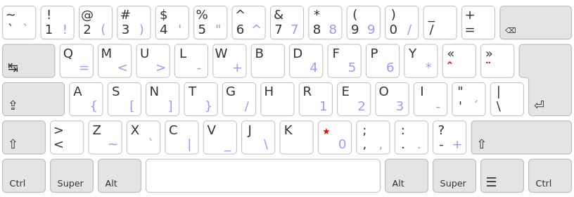
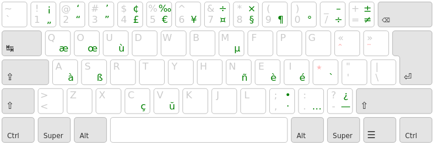
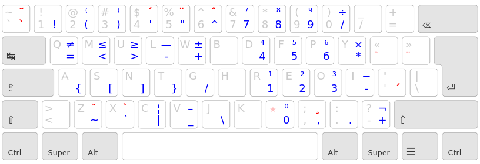

Ergo-L
================================================================================

A Colemak-style layout for French-speaking users.


TL;DR:
--------------------------------------------------------------------------------

* an optimized Colemak/Qwerty variant for French and English;
* all common keyboard shortcuts are preserved (like in Colemak);
* use a dead key on the home row for the most frequent accented characters;
* use the AltGr layer for programming symbols. Or don’t use it at all, and keep two alt keys.

This layout claims to be better than Bépo for French and better than Qwerty for programming.


Layout
--------------------------------------------------------------------------------



The dead <kbd>★</kbd> key gives access to all acute accents, grave accents, cedillas, digraphs and quote signs you’ll need to write in proper French:



… which leaves the AltGr layer fully available for any customization you have in mind.



The default layout allows to write in English, French, German and Esperanto easily.

[More information on the website](https://ergol.org) (in French).


Make your own
--------------------------------------------------------------------------------

You’ll need the latest version of [Kalamine](https://github.com/fabi1cazenave/kalamine) to build your own layout:

```bash
pip3 install kalamine
```

And build your custom layout like this:

```bash
kalamine MyCustomLayout.yaml
```
