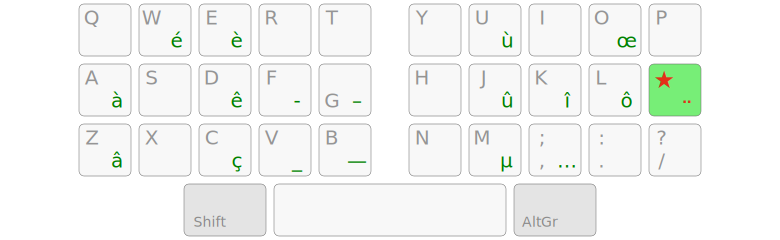
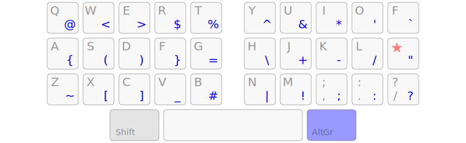

Qwerty-Lafayette
================================================================================

A compact Qwerty layout for French-speaking users.


TL;DR:
--------------------------------------------------------------------------------

* use a dead key on the home row for all French accented characters;
* use the AltGr layer to access programming symbols without stretching your fingers. Or don’t use it at all, and use Qwerty symbols in their standard positions.

This layout claims to be better than Azerty for French and better than Qwerty for programming.


Layout
--------------------------------------------------------------------------------

The <kbd>;</kbd> key is turned into a dead key that gives access to all acute accents, grave accents, cedillas, digraphs and quote signs you’ll need to write in proper French:



… which leaves the AltGr layer fully dedicated to programming symbols:



More information on the website (in French): https://qwerty-lafayette.org/


Download
--------------------------------------------------------------------------------

https://qwerty-lafayette.org/#pilotes


Make Your Own!
--------------------------------------------------------------------------------

The latest version of [Kalamine](https://github.com/fabi1cazenave/kalamine) is recommended to customize your layout:

```bash
pip3 install kalamine
```

[Grab the TOML layout](layouts/lafayette.toml), start the Kalamine previewer and edit your layout with your preferred text editor:

```bash
kalamine watch lafayette.toml
```

Then build your custom layout drivers:

```bash
kalamine make lafayette.toml
```


Why the name?
--------------------------------------------------------------------------------

Because of [Gilbert du Motier, Marquis de Lafayette](https://en.wikipedia.org/wiki/Gilbert_du_Motier,_Marquis_de_Lafayette).


Alternatives
--------------------------------------------------------------------------------

There are other ways to use a Qwerty-US keyboard for French. Here are the two most intuitive ones:

* [qwerty-intl](https://en.wikipedia.org/wiki/QWERTY#US-International) — turns <kbd>`</kbd><kbd>~</kbd><kbd>'</kbd><kbd>"</kbd><kbd>^</kbd> into dead keys;
* [qwerty-fr](https://github.com/qwerty-fr/qwerty-fr) — smart use of the AltGr layer for direct access to all French accented characters, as well as dead keys for other characters.

Qwerty-Lafayette offers sharper typography and better ergonomics, but might have a steeper learning curve for non-touch-typists.
